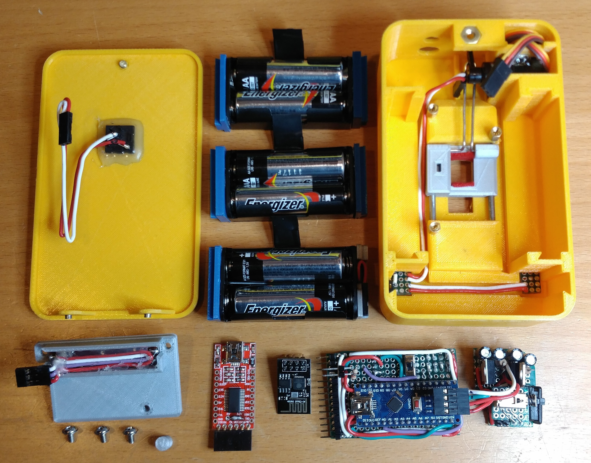
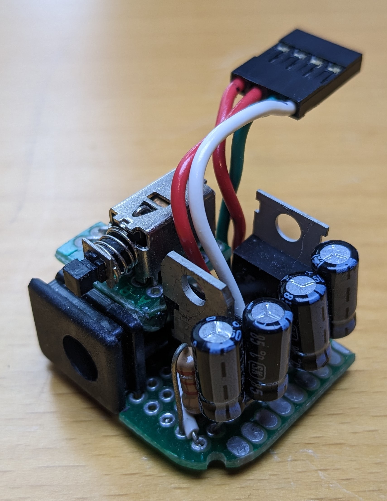
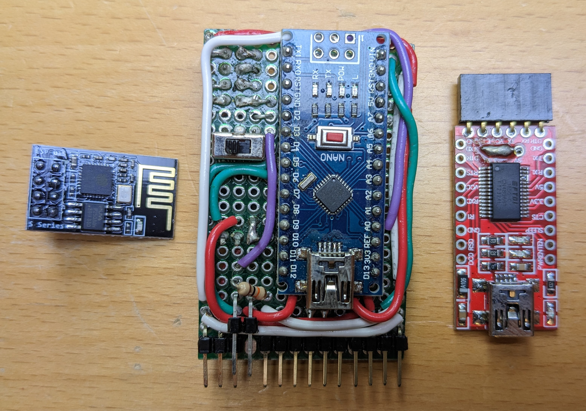

# iot-light-switch-v1

See V2 ([iot-light-switch-v2](https://github.com/jarpoole/iot-light-switch-v2)) for a second more polished attempt at this concept.

## Features

1. Voice control through google-assisant.
2. Tool-less magnetic installation.
3. DC barrel jack backup power source.

## Limitations

1. Not compatible with rocker style switches.
2. Not compatible with double switches.
3. Short battery life without the option to recharge.
4. Complex hardware with both an `ESP8266` to connect to the internet and an `Arduino NANO` to control the servo.

## Internals

## Mechanical

## Electrical

